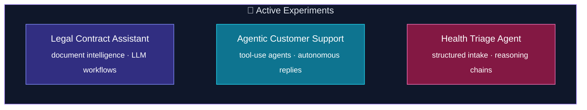

<!--
  GitHub Profile README — Ramasamy T
  Copy to: https://github.com/ramasamy-24-t/ramasamy-24-t/README.md

  Theme — Midnight Aurora
  #0f172a · #667eea · #a78bfa · #22d3ee · #f472b6
-->

<div align="center">


[](https://github.com/ramasamy-24-t)
&nbsp;
[](https://ramasamyt.vercel.app/)
&nbsp;
[](https://www.linkedin.com/in/ramasamy-24-t)
&nbsp;
[](mailto:rsamy2426@gmail.com)

<br/><br/>

[](https://leetcode.com/u/ramasamy-24-t/)
&nbsp;
[](https://www.codechef.com/users/kit28aiml049)
&nbsp;
[](https://codeforces.com/profile/ramasamy-24-t)

</div>

<br/>

<div align="center">

[](https://git.io/typing-svg)

</div>

<br/>

<!-- ═══ UNIQUE ABOUT — Agent manifest, not Python class ═══ -->

## ⚡ Identity Core

<table>
<tr>
<td width="52%" valign="top">

**`ramasamy.agent.yaml`** — system manifest

```yaml
agent:
  id: ramasamy-t
  location: Coimbatore, Tamil Nadu 🇮🇳
  education: B.E. AI & ML @ KIT-CBE (2024–2028)

mission: |
  Build autonomous systems that ingest messy inputs,
  reason with LLMs, and output reliable production workflows.

runtime:
  primary:   [Python, FastAPI, AWS Lambda]
  interface: [React, Tailwind CSS]
  intelligence: [RAG, OpenAI, Document AI, Agents]

modes:
  🛠 build:   ship backends · pipelines · integrations
  🧠 learn:   LLM tooling · MLOps · system design
  🏁 compete: LeetCode · CodeChef · Codeforces

availability: open_to_internships & tech_collaborations
signal:       "Let's build something that actually ships."
```

</td>
<td width="48%" align="center" valign="middle">

```
╔══════════════════════════════════════╗
║  RAM-OS  ·  agent runtime v2.026     ║
╠══════════════════════════════════════╣
║  ▰▰▰▰▰▰▰▰▰▰▱▱▱▱▱  boot sequence      ║
║  ✓ ingest layer      · online        ║
║  ✓ reasoning layer   · online        ║
║  ✓ action layer      · online        ║
║  ✓ DSA engine        · warmed up     ║
╠══════════════════════════════════════╣
║  > await collaboration_request()     ║
╚══════════════════════════════════════╝
```

<br/>


</td>
</tr>
</table>

<br/>

<div align="center">


*How I think about engineering — every project is a pipeline from chaos to clarity.*

</div>

---

## 🛠️ Tech Stack

<div align="center">


</div>

<br/>

<details>
<summary><b>📦 Stack breakdown by layer</b></summary>
<br/>

| Layer | Tools |
|:------|:------|
| **Languages** | Python · C · C++ · Java · JavaScript · HTML |
| **Frontend** | React · Tailwind CSS |
| **Backend** | FastAPI · Flask · Node.js |
| **Cloud** | AWS Lambda · S3 · API Gateway · Cognito · Aurora · Bedrock · SQS |
| **AI / ML** | RAG · OpenAI API · OpenCV · MediaPipe · scikit-learn · NumPy · Pandas |
| **Data** | MongoDB · MySQL |
| **DevOps** | Git · GitHub |

</details>

---

## 📊 GitHub Analytics

<div align="center">

<a href="https://github.com/ramasamy-24-t">
  
</a>
<a href="https://github.com/ramasamy-24-t">
  
</a>

<br/><br/>

[](https://github.com/ramasamy-24-t)

<br/><br/>

[](https://github.com/ramasamy-24-t)

</div>

---

## 💼 Experience

<details open>
<summary><b>🏢 Wincredible Technologies — AI Engineering Intern · Mar 2026 – Present · Remote</b></summary>
<br/>


<br/>

| Phase | What I shipped |
|:------|:---------------|
| **Ingest** | AI-driven document intelligence & backend automation components |
| **Reason** | LLM integrations into production workflows for faster processing |
| **Act** | Database schemas, APIs, and scalable AWS serverless architecture |

</details>

---

## 🚀 Featured Projects

<div align="center">

| | Project | Stack | One-liner |
|:--:|:--------|:------|:----------|
| 🌱 | [**Precision Farming Assistant**](https://github.com/ramasamy-24-t/Precision-Farming-Assistant) | RAG · ChromaDB · Flask | Hackathon-winning crop advisory from PDF knowledge bases |
| 💼 | [**JobAssistant (JGenie)**](https://github.com/ramasamy-24-t/job_assistant) | Flask · Playwright · Telegram | Autonomous career agent — scrape, match, apply, notify |
| 🌤️ | [**Weather Dashboard**](https://github.com/ramasamy-24-t/Aakash-Ka-Vaani) · [live](https://aakash-ka-vaani-v1.vercel.app/) | MERN · Groq | AI weather companion with contextual recommendations |
| 🤟 | [**Sign Language Translation**](https://github.com/ramasamy-24-t/Indian-Sign-Language-Detection) | MediaPipe · OpenCV | Real-time gesture → text → speech pipeline |
| 🖐️ | [**Gesture Keyboard**](https://github.com/ramasamy-24-t/gesture-controlled-keyboard) | Python · MediaPipe | Hands-free keyboard control via webcam |
| 😉 | [**Face Sketch Overlay**](https://github.com/ramasamy-24-t/face-detect-sketch) | OpenCV | Live detection + Canny edge art overlay |

</div>

---

## 🏁 Competitive Programming

<div align="center">

```
   PLATFORM        RATING        RANK              PROFILE
  ─────────────────────────────────────────────────────────────
   LeetCode         1831         #1,02,825         ramasamy-24-t
   CodeChef         1571         #19,580           kit28aiml049
   Codeforces       1086         #92,675           ramasamy-24-t
  ─────────────────────────────────────────────────────────────
```

</div>

---

## 🎓 Education

| Level | Institution | Period | Score |
|:------|:------------|:-------|:------|
| **B.E. AI & Machine Learning** | KIT-CBE, Coimbatore | 2024 – 2028 | Pre-final year |
| **HSC** | SJSVM Hr. Sec. School | 2021 – 2024 | 93.3% · 560/600 |
| **SSLC** | SJSVM Hr. Sec. School | — | 94.4% · 472/500 |

**Coursework:** DBMS · DSA · Machine Learning · Probability & Statistics · OOP

---

## 🔭 Lab — Currently Building

<div align="center">



</div>

---

## 🎖️ Achievements & Certifications

<div align="center">

| 🏅 | Achievement | Details |
|:--:|:------------|:--------|
| 🥇 | **Hack Smart Hackathon — 1st Prize** | 36-hour hackathon conducted at KIT-CBE |
| 🥇 | **Code Wars 2.0 — 1st Prize** | Park College of Engineering & Technology |
| 🥇 | **Code It — 1st Prize** | Sri RamaKrishna Institute of Technology |
| 🥇 | **StructX Hackathon — 3rd Prize** | DSA Coding challenge |
| 💻 | **LeetCode** | Max Rating **1831** · **650+** solved · Top **8.11%** globally · Highest Rank **#2,950** · 3 Badges |
| ⚡ | **Codeforces** | Max Rating **1088** · **26** problems · Highest Rank **#5,428** (Round 31 Div. 1 + Div. 2) |
| 🍴 | **CodeChef** | Max Rating **1571** · ⭐⭐ · **600+** problems · Highest Rank **#681** (Starters 241 Div. 3) · Global **#19,580** |
| ☁️ | **AWS Certified Cloud Practitioner** | Amazon Web Services · 2025 |
| 🐍 | **Python for Data Science** | Top 1% · Silver + Elite · 2025 |
| ©️ | **NPTEL — Problem Solving using C** | Top 5% · Silver + Elite · 2025 |
| 🔷 | **Deloitte Technology Job Simulation** | 2025 |
| 🤖 | **Deploy Production Ready Agents** | Google Skills · 2026 |

</div>

---

<div align="center">

<br/>

```
     ╭──────────────────────────────────────────╮
     │  COLLABORATION REQUEST RECEIVED ✓        │
     │  → linkedin · github · email             │
     ╰──────────────────────────────────────────╯
```

<br/>

[](https://www.linkedin.com/in/ramasamy-24-t)
&nbsp;
[](https://github.com/ramasamy-24-t)
&nbsp;
[](mailto:rsamy2426@gmail.com)

<br/><br/>

*"Every great system starts as a messy pipeline — then someone automates it."*

</div>


