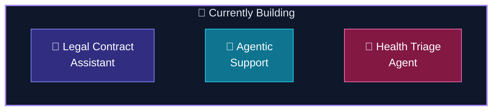

<!--
  GitHub Profile README — Ramasamy T
  → Copy to: github.com/ramasamy-24-t/ramasamy-24-t/README.md

  Wow stack: 3D contrib · cyberpunk cards · skillicons.dev · mermaid · trophies
  Optional: add snake.yml workflow for animated contribution snake (see repo docs)
-->

<div align="center">

<!-- HERO -->


<br/>

<!-- LIVE METRICS STRIP -->


<br/><br/>

<a href="https://ramasamyt.vercel.app/"></a>
<a href="https://www.linkedin.com/in/ramasamy-24-t"></a>
<a href="mailto:rsamy2426@gmail.com"></a>

<br/><br/>


<br/><br/>

<!-- 3D CONTRIBUTION — main wow element -->


</div>

---

## ⚡ Identity Core

<table>
<tr>
<td width="52%" valign="top">

**`ramasamy.agent.yaml`**

```yaml
agent:
  id: ramasamy-t
  location: Coimbatore, Tamil Nadu 🇮🇳
  education: B.E. AI & ML @ KIT-CBE · 2024–2028

mission: |
  Ingest messy real-world inputs → reason with LLMs →
  ship reliable automated workflows to production.

runtime:
  core:   [Python, FastAPI, AWS Lambda, React]
  brain:  [RAG, OpenAI, Document AI, Agents]
  engine: [DSA · LeetCode · CodeChef · Codeforces]

modes:
  build:    backends · pipelines · integrations
  compete:  algorithms · contests · optimization
  explore:  agentic systems · MLOps · design

status: OPEN — internships & collaborations welcome
```

</td>
<td width="48%" align="center" valign="middle">

```
╔══════════════════════════════════════╗
║   RAM-OS  ·  agent runtime v2.026    ║
╠══════════════════════════════════════╣
║  ▰▰▰▰▰▰▰▰▰▰▰▰▱▱▱▱  initializing…     ║
║  ✓ ingest layer       ONLINE         ║
║  ✓ reasoning layer    ONLINE         ║
║  ✓ action layer       ONLINE         ║
║  ✓ DSA engine         WARM           ║
╠══════════════════════════════════════╣
║  > await collaboration_request()     ║
╚══════════════════════════════════════╝
```

<br/>


</td>
</tr>
</table>

<div align="center">


</div>

---

## 📊 GitHub Dashboard

<div align="center">

<!-- Cyberpunk summary cards -->


<br/>


<br/><br/>


<br/><br/>


<br/><br/>


<br/><br/>


</div>

---

## 🛠️ Tech Arsenal

<div align="center">

**Languages & Frontend**

<br/>


<br/><br/>

**Backend · Cloud · AI · Tools**

<br/>


<br/><br/>


</div>

<details>
<summary><b>📦 Full stack breakdown</b></summary>
<br/>

| Layer | Tools |
|:------|:------|
| **Languages** | Python · C · C++ · Java · JavaScript · HTML |
| **Frontend** | React · Tailwind CSS |
| **Backend** | FastAPI · Flask · Node.js |
| **Cloud** | AWS Lambda · S3 · API Gateway · Cognito · Aurora · Bedrock · SQS |
| **AI / ML** | RAG · OpenAI API · OpenCV · MediaPipe · scikit-learn · NumPy · Pandas |
| **Data** | MongoDB · MySQL |
| **DevOps** | Git · GitHub · Docker · Linux |

</details>

---

## 💼 Experience

<details open>
<summary><b>🏢 Wincredible Technologies — AI Engineering Intern · Mar 2026 – Present · Remote</b></summary>
<br/>


<br/><br/>

| Phase | Impact |
|:------|:-------|
| **📄 Ingest** | AI document intelligence & backend automation components |
| **🧠 Reason** | LLM integrations in production workflows |
| **⚙️ Act** | Scalable AWS serverless · APIs · database architecture |

</details>

---

## 🚀 Featured Projects

<div align="center">

| | Project | Stack | Impact |
|:--:|:--------|:------|:-------|
| 🌱 | [**Precision Farming Assistant**](https://github.com/ramasamy-24-t/Precision-Farming-Assistant) | RAG · ChromaDB · Flask | 🏆 Hackathon RAG crop advisory from PDFs |
| 💼 | [**JobAssistant (JGenie)**](https://github.com/ramasamy-24-t/job_assistant) | Flask · Playwright · Telegram | Autonomous career agent end-to-end |
| 🌤️ | [**Weather Dashboard**](https://github.com/ramasamy-24-t/Aakash-Ka-Vaani) · [live ↗](https://aakash-ka-vaani-v1.vercel.app/) | MERN · Groq | AI weather companion with live demo |
| 🤟 | [**Sign Language AI**](https://github.com/ramasamy-24-t/Indian-Sign-Language-Detection) | MediaPipe · OpenCV | Gesture → text → speech pipeline |
| 🖐️ | [**Gesture Keyboard**](https://github.com/ramasamy-24-t/gesture-controlled-keyboard) | Python · MediaPipe | Webcam hands-free keyboard |
| 😉 | [**Face Sketch AI**](https://github.com/ramasamy-24-t/face-detect-sketch) | OpenCV | Live detection + Canny art overlay |

</div>

---

## 🏁 Competitive Programming

<div align="center">


<br/><br/>

```
╔══════════════════════════════════════════════════════════════╗
║  PLATFORM       RATING     GLOBAL RANK        PROFILE        ║
╠══════════════════════════════════════════════════════════════╣
║  LeetCode        1831       #1,02,825         ramasamy-24-t  ║
║  CodeChef        1571       #19,580           kit28aiml049   ║
║  Codeforces      1086       #92,675           ramasamy-24-t  ║
╚══════════════════════════════════════════════════════════════╝
```

</div>

---

## 🎓 Education

| Level | Institution | Period | Score |
|:------|:------------|:-------|:------|
| **B.E. AI & Machine Learning** | KIT-CBE, Coimbatore | 2024 – 2028 | Pre-final year |
| **HSC** | SJSVM Hr. Sec. School | 2021 – 2024 | 93.3% · 560/600 |
| **SSLC** | SJSVM Hr. Sec. School | — | 94.4% · 472/500 |

**Coursework:** DBMS · DSA · Machine Learning · Probability & Statistics · OOP

---

## 🔭 Lab — Active Experiments

<div align="center">



</div>

---

## 🎖️ Achievements & Certifications

<div align="center">

| 🏅 | Achievement | Details |
|:--:|:------------|:--------|
| 🥇 | **Hack Smart Hackathon — 1st Prize** | 36-hour hackathon · KIT-CBE |
| 🥇 | **Code Wars 2.0 — 1st Prize** | Park College of Engineering & Technology |
| 🥇 | **Code It — 1st Prize** | Sri RamaKrishna Institute of Technology |
| 🥇 | **StructX Hackathon — 3rd Prize** | DSA Coding challenge |
| 💻 | **LeetCode** | Max **1831** · **650+** solved · Top **8.11%** · Best **#2,950** · 3 Badges |
| ⚡ | **Codeforces** | Max **1088** · **26** problems · Best **#5,428** |
| 🍴 | **CodeChef** | Max **1571** · ⭐⭐ · **600+** problems · Best **#681** |
| ☁️ | **AWS Cloud Practitioner** | Amazon Web Services · 2025 |
| 🐍 | **Python for Data Science** | Top 1% · Silver + Elite · 2025 |
| ©️ | **NPTEL — Problem Solving in C** | Top 5% · Silver + Elite · 2025 |
| 🔷 | **Deloitte Tech Simulation** | 2025 |
| 🤖 | **Deploy Production Ready Agents** | Google Skills · 2026 |

</div>

---

<div align="center">


<br/><br/>

```
     ╭──────────────────────────────────────────╮
     │  🤝 COLLABORATION REQUEST RECEIVED ✓     │
     │  linkedin · github · email · portfolio   │
     ╰──────────────────────────────────────────╯
```

<br/>

<a href="https://www.linkedin.com/in/ramasamy-24-t"></a>
<a href="https://github.com/ramasamy-24-t"></a>
<a href="mailto:rsamy2426@gmail.com"></a>
<a href="https://ramasamyt.vercel.app/"></a>

<br/><br/>

*"Every great system starts as a messy pipeline — then someone automates it."*

<br/><br/>


</div>
